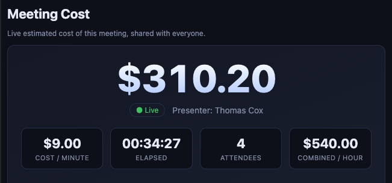
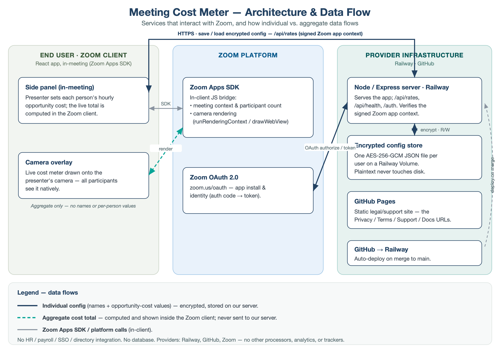

# Meeting Cost — Zoom App (MVP prototype)

Shows the **live estimated cost of a Zoom meeting** as a "taxi meter" overlay on
the presenter's video, exactly like Zoom's Timer app. The presenter owns a
private, best-guess table of per-person **hourly opportunity cost** in the in-meeting
**side panel** and clicks **Show cost on video**; the live total then renders onto
their camera feed (via Zoom's camera rendering context) so every participant sees it
natively — no second app, no shared screen, no collaborate space.

> **"Rate" means hourly opportunity cost, not pay** — see
> [`dev-docs/opportunity-cost-rate.md`](dev-docs/opportunity-cost-rate.md) for the canonical definition.

> The app does **not** integrate with HR, payroll, SSO, or any employee
> directory. The presenter is asked to estimate each person's hourly opportunity
> cost; the app computes the cost from those numbers and does not verify them.



## What's in this repo

This is a **runnable browser prototype** with **Zoom-ready structure**:

- `client/` — React + Vite frontend (the in-meeting UI)
- `server/` — thin Node + Express backend (Zoom OAuth scaffold, `/api/health`, serves the built client)
- The Zoom Apps SDK, OAuth, and Marketplace config are scaffolded behind
  adapters so you can flip to a real in-Zoom app without rewriting the app.

**Where the rate table lives (privacy).** The presenter's private rate table
(names + estimated rates) is **stored on the server**, **encrypted at rest**
(AES-256-GCM, a per-user key derived from the `RATE_STORE_KEY` secret + the
presenter's Zoom user id), keyed to that Zoom identity so it loads in their future
meetings. It is **not** end-to-end encrypted: the running server — and therefore the
app **operator** — can decrypt it. A leaked volume/backup alone is useless without
`RATE_STORE_KEY`. The data is never shared with meeting participants or other users
(only resolved, sanitized aggregate numbers go to the overlay). `localStorage` is no
longer used; if the server is unreachable/unconfigured the app runs **session-only**
(no persistence). *(This is a deliberate departure from the earlier "browser-only"
model, adopted because `localStorage` isn't durable inside the Zoom client.)*

## Quick start

```bash
npm install            # installs root + client + server workspaces
npm run dev            # starts server (:8787) and Vite client (:5173)
```

Then open <http://localhost:5173>.

### Try it (mock mode)

In the browser prototype the running context is mocked as the **side panel**, so
you see the presenter view with a **simulated camera frame** beneath the live
readout:

1. Click **Show cost on video**. The taxi meter appears in the corner of the
   simulated camera frame and starts ticking.
2. Add/remove simulated participants and edit rates — the readout and the
   overlay update together.
3. **Hide from video** stops the overlay; **End session** stops counting.

Inside real Zoom, "Show cost on video" enters the camera rendering context and
composites the same overlay onto your actual video feed for all participants.

## Features (MVP)

**Camera overlay (everyone sees, natively):** large live total cost, cost/minute,
elapsed time, and attendee count — composited onto the presenter's video. No
private rates or participant names are ever sent to the overlay.

**Presenter side panel (private):** show/hide the overlay, pause/resume counting,
end session, default rate, loaded-cost multiplier, add/edit/delete private rate
rules, name aliases, and per-participant overrides for the current meeting.

**Matching logic:** normalize names (trim, lowercase, collapse spaces, strip
punctuation/accents) → exact match → alias → manual override → default rate.
Each row reports its source: `matched`, `default`, or `manual override`.

## Architecture

```
Side panel (presenter)                         Camera context (all participants)
──────────────────────                         ─────────────────────────────────
private rate table ─┐
participants  ──────┤ resolveAll() → computeTotals()
overrides ──────────┘            │
                                 ▼  buildOverlayState() (aggregate only)
                        adapter.postMessage() ──► Zoom ──► adapter.onMessage()
                                                              │
                                                              ▼  CostOverlay
                                                    (taxi meter on the video)
```

- Render routing by Zoom running context: `client/src/lib/renderMode.js`
  (`inCamera` → overlay, side panel → config). `client/src/Root.jsx` mounts the
  right tree.
- Matching/cost logic: `client/src/lib/` (`normalize`, `matching`, `cost`,
  `overlayState`).
- Zoom integration adapter: `client/src/zoom/zoomAdapter.js` — `MockZoom` (records
  overlay calls + loops the message bridge back for the simulated preview) and
  `RealZoom` (camera rendering context via `@zoom/appssdk`).
- The server (`server/`) is a thin Express app: OWASP secure headers, Zoom OAuth
  scaffold, `/api/health`, and serving the built client. State flows entirely
  through Zoom's in-client message bridge — there is no server-side WebSocket.



## Technology stack

- **Frontend:** React 18 single-page app built with Vite 6, running inside the Zoom
  client via the **Zoom Apps SDK** (`@zoom/appssdk`) — used for meeting context,
  participant counts, and compositing the live cost meter onto the presenter's camera
  feed (Zoom camera/Layers rendering context). Plain CSS; no UI framework, web fonts,
  CDN, or analytics.
- **Backend:** Node.js 22 + Express, serving the built client and a minimal API
  (`/api/health`, `/api/log`, `/api/rates`). No database.
- **Auth:** Zoom OAuth 2.0; requests authenticated via the signed Zoom App Context
  header, decrypted server-side (AES-256-GCM).
- **Storage:** each presenter's config saved as a per-user AES-256-GCM-encrypted JSON
  file on a persistent volume (Node `crypto`); plaintext never hits disk. The only providers
  are Railway (hosting/storage), GitHub, and Zoom — no other data processors, and no
  analytics, advertising, or data sale.
- **Security:** HTTPS/HSTS, Content-Security-Policy, `nosniff`, and `no-store` headers
  on all responses.
- **Hosting:** Railway (Node service, auto-deploy from GitHub); GitHub Pages serves the
  static legal/support pages.

Full diagram source: [`dev-docs/meeting-cost-architecture.svg`](dev-docs/meeting-cost-architecture.svg).

## Going live in Zoom (later)

See `server/zoom-app-config.md` for Marketplace setup (scopes, redirect URLs,
SDK capabilities) and `server/.env.example` for OAuth credentials. Set
`VITE_USE_ZOOM=1` for the client to use the real Zoom SDK and install
`@zoom/appssdk`. Real in-Zoom testing runs against the Railway deploy (see
"Deploy to Railway" below) — there is no local tunnel.

## Deploy to Railway (from GitHub)

> **New to Railway, or setting up storage / dev + prod environments?** Follow the
> step-by-step **[`dev-docs/railway-setup.md`](dev-docs/railway-setup.md)** — it covers the
> deploy, every variable, the persistent-storage **Volume**, and the two-environment
> (Development/Production) layout. The summary below is the quick reference.

The repo is deploy-ready: `railway.json` selects Railway's **Railpack** builder and
declares the build (`npm run build`), start (`npm start`), and a health check at
`/api/health`. The server boots with **no committed `.env`** — config comes from
environment variables you set in the Railway dashboard.

1. Create a Railway project and **Deploy from GitHub repo** (this repo); pushes to
   `main` then build and deploy automatically.
2. Set these **variables** in the Railway service:
   - `ZOOM_CLIENT_ID` — Zoom app client id (runtime)
   - `ZOOM_CLIENT_SECRET` — Zoom app client secret (runtime)
   - `ZOOM_REDIRECT_URI` — `https://<app>.up.railway.app/auth/callback` (runtime)
   - `VITE_USE_ZOOM` — `1` so the **build** inlines the real Zoom SDK (build-time;
     Vite bakes it into the bundle, so it must be set before/at build)
   - `RATE_STORE_KEY` — a strong random secret used to encrypt each presenter's rate
     table at rest (runtime). **Keep it separate from `ZOOM_CLIENT_SECRET`** so rotating
     Zoom credentials doesn't make stored data undecryptable. If unset, the rate store
     fails closed (`/api/rates` → `503`) and the app runs session-only.
   - `DATA_DIR` — the mount path of a Railway **Volume** (e.g. `/data`) where the
     encrypted rate files live. Attach a Volume to the service and point `DATA_DIR` at
     it, or persistence is lost on redeploy.
   - **Do not set `PORT`** — Railway injects it; the server reads it automatically.
3. In the **Zoom Marketplace** app, set the OAuth redirect URL and domain allow
   list to the same `https://<app>.up.railway.app` host, and add `getAppContext` under
   **Features → Add APIs** (used to identify the presenter for the rate store) — see
   `server/zoom-app-config.md`.
4. Railway marks the deploy healthy once `GET /api/health` returns `200`.

No secrets live in the repo — `server/.env.example` lists the keys with empty
values for local use only.

## Secret-scanning guardrail

A local **pre-commit hook** blocks any commit whose staged changes look like they
contain a secret (PEM private keys, cloud access keys, or high-entropy values
assigned to secret-named identifiers). It is self-contained — no external binary.

- It activates automatically: `npm install` runs a guarded `postinstall` that sets
  `git config core.hooksPath .githooks` (a no-op outside a git work tree, so CI and
  Railway builds are unaffected).
- The detector lives in `scripts/secret-scan/` and runs as part of `npm test`.
- **Allowlisting a deliberate synthetic fixture:** add the marker
  `pragma: allowlist secret` on the same line. Use this only for fake, non-real
  values — **never** commit a real credential (rotate it if one is exposed).
- Generated review transcripts (`reviews/*.codex.json`) are exempt automatically —
  they quote secret-shaped examples and are machine output that can't carry a marker.

Server-side, the GitHub repo has secret-scanning **push protection** enabled. To
also catch generic secrets (e.g. a Zoom client secret), enable **"Scan for
non-provider patterns"** under repo *Settings → Code security → Secret scanning*
(a one-click toggle; it is not currently settable via the REST API).

## Security & policies

- **Report a vulnerability:** see [`SECURITY.md`](SECURITY.md) (private disclosure to the
  security contact).
- **SAST:** GitHub **CodeQL** scans JS/TS on every push/PR to `main` and weekly
  ([`.github/workflows/codeql.yml`](.github/workflows/codeql.yml)).
- **Dependencies:** **Dependabot** opens weekly update PRs
  ([`.github/dependabot.yml`](.github/dependabot.yml)).
- **CI:** test + build runs in GitHub Actions on every push/PR
  ([`.github/workflows/ci.yml`](.github/workflows/ci.yml)).
- **Branch protection:** `main` is governed by a repository ruleset (PR required, CodeQL +
  CI checks required, force-push/deletion blocked).
- **Policy set** (operational detail) in [`dev-docs/policies/`](dev-docs/policies/):
  [SSDLC](dev-docs/policies/ssdlc.md) ·
  [Security](dev-docs/policies/security-policy.md) ·
  [Vulnerability management](dev-docs/policies/vulnerability-management.md) ·
  [Data retention & protection](dev-docs/policies/data-retention-and-protection.md) ·
  [Incident response](dev-docs/policies/incident-response.md) ·
  [Infrastructure & dependencies](dev-docs/policies/dependency-management.md).
- **Public-facing:** [Security overview](https://thomasbcox.github.io/zoom-meeting-cost/security.html)
  · [Privacy Policy](https://thomasbcox.github.io/zoom-meeting-cost/privacy.html).

## License

[MIT](LICENSE) © 2026 Thomas Cox
